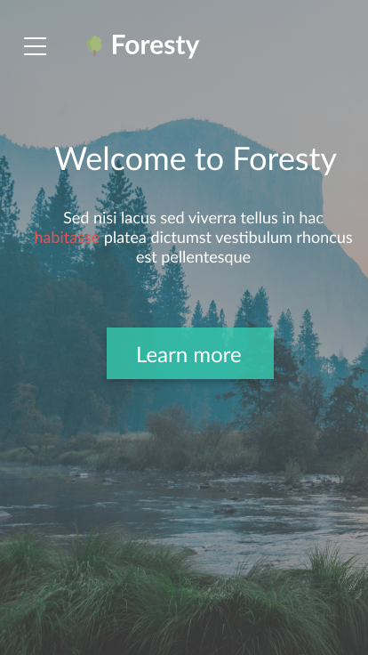
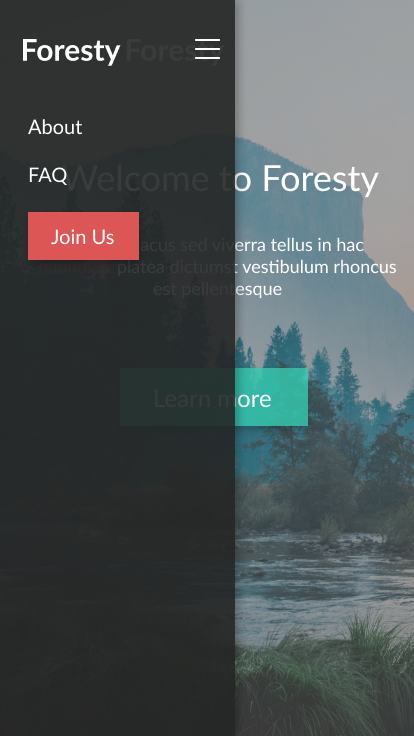

# Foresty


_Fig. The hero section of Foresty's landing page._

## Provided resources

- Figma design: https://www.figma.com/file/9hMAB2Oqu7dVrMFeyesjBP/Foresty?node-id=0%3A1

- You need to login with a gmail account. Once logged in, you can inspect the CSS details of each element: color codes, font size, etc. (look for the "Inspect" tab on the right panel).

- You can find the assets (background image and logo) in the `assets` folder.

_\*\*Notes: The CSS found in the design should only be used as a reference (it's great for inspecting the color codes, font familiy,...) and you shouldn't just copy-paste it to your code since a lot of it is not "proper" and "clean" CSS. It's advised that you should still implement CSS yourself, especially when it comes to layout and structure of the webpage._

## Functional requirements

- N/A

## Visual requirements

- The goal is to replicate the UI of the given design as much as you can.

  ### Desktop view

  

  _Fig. Desktop view._

  ### Mobile view

  

  _Fig 2. Mobile view with hambuger menu._

  

  _Fig 3. Mobile with opened hambuger menu._

## Project Structure

```bash
Foresty
├── assets
│   └── images
│       ├── background.png
│       ├── text-logo.png
│       └── tree-logo.png
├── index.html
├── styles.css
└── README.md
```

or

```bash
Foresty
├── assets
│   ├── background.png
│   ├── text-logo.png
│   └── tree-logo.png
├── index.html
├── styles.css
└── README.md
```

## Deployment

Deploy and host it on Netlify (hint: google "Netlify Drag and Drop"). Once deployed, include the URL in the Readme.

Link: [xxx].netlify.app

## Version Control

Make sure to use Git and host the source code on your personal Github.

## Skills assessed

### HTML/CSS

- Convert design to HTML/CSS
- Learn to inspect styles (color codes, fonts, etc.) from design
- Work with fonts
- Work with images
- Responsive design
- Work with box model (margin, padding, ...)
- Apply layout using CSS flexbox/grid
