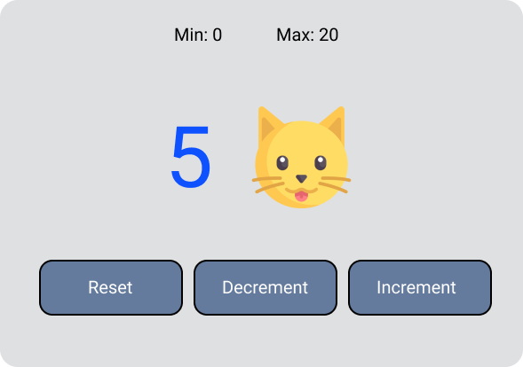
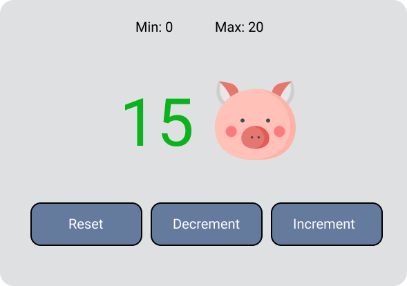
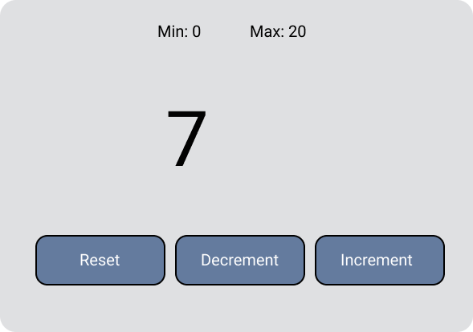

# Fun Counter


_Fig. A counter app with customized functionalities._

## Functional requirements

- Display a counter with 3 buttons: Reset, Decrement and Increment + potentially an additional animal picture next to the counter value (as shown in the above figure).
- Clicking on `Decrement` should decrease the counter value by one.
- Clicking on `Increment` should increase the counter value by one.
- Clicking on `Reset` should reset the counter value to 0.
- The values are in range `[0, 20]`, meaning negative numbers and numbers > 20 are not allowed. If user clicks on `Decrement` when the value is 0 OR if user clicks on `Increment` when the value is 20, it should do nothing.

  - Bonus: You can also make it such that: If the value is 0 and user clicks `Decrement`, the value should jump to 20. And if the value is 20 and user clicks `Increment`, the value jumps back to 0.

- We also want to change the color of the number and the animal picture next to it based on the counter value:

  - If the value is divisible by `3` then the number's color should be `red` and it shows a `dog` image next to it.
  - If the value is divisible by `5` then the number's color should be `blue` and it shows a `cat` image next to it.
  - If the value is divisible by `both 3 and 5` then the number's color should be `green` and it shows a `pig` image next to it.
  - `Otherwise` if it doesn't satisfy none of the above 3 cases, the number's default color should be `black` and it shows `no image`.

    

    _Fig 1. When the number is divisible by 3 only._

    

    _Fig 2. When the number is divisible by 3 only._

    

    _Fig 3. When the number is divisible by both 3 and 5._

    

    _Fig 4. Defaut color without animal pic._

## Visual requirements

- The goal is to replicate the UI based on the given design.
- For this project, focus more on the layout/structure and less on specific styling details (color, border, font size, etc.) for each element. As long as it looks similar to the original design it's good enough.

## Project Structure

(Recommended)

```bash
Counter
├── assets
│   └── images
│       ├── cat.png
│       ├── dog.png
│       ├── pig.png
├── index.html
├── styles.css
├── script.js
└── README.md
```

## Deployment

Deploy and host it on Netlify (hint: google "Netlify Drag and Drop"). Once deployed, include the URL in the Readme.

Link: [xxx].netlify.app.

## Version Control

Make sure to use Git and host the source code on your personal Github.

## Provided resources

You can find the animal pics (dog, cat, pig) in the `assets` folder.
