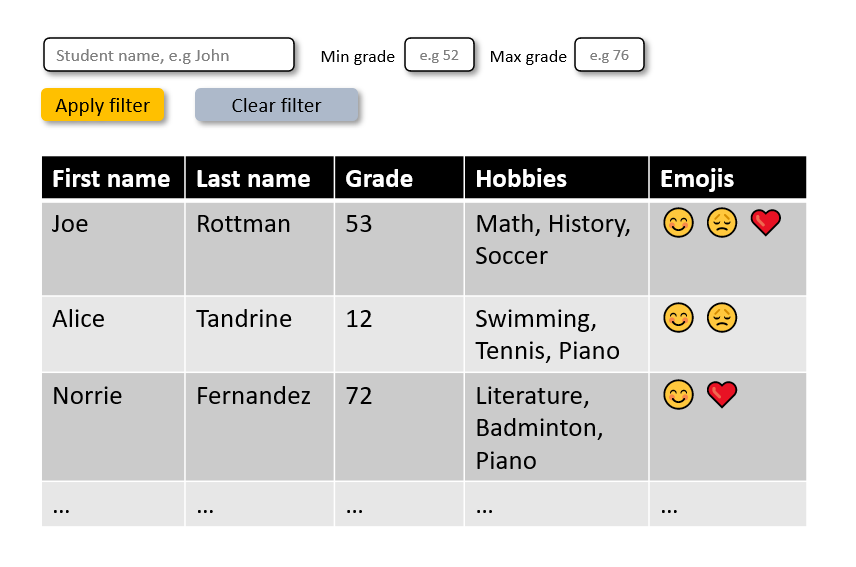
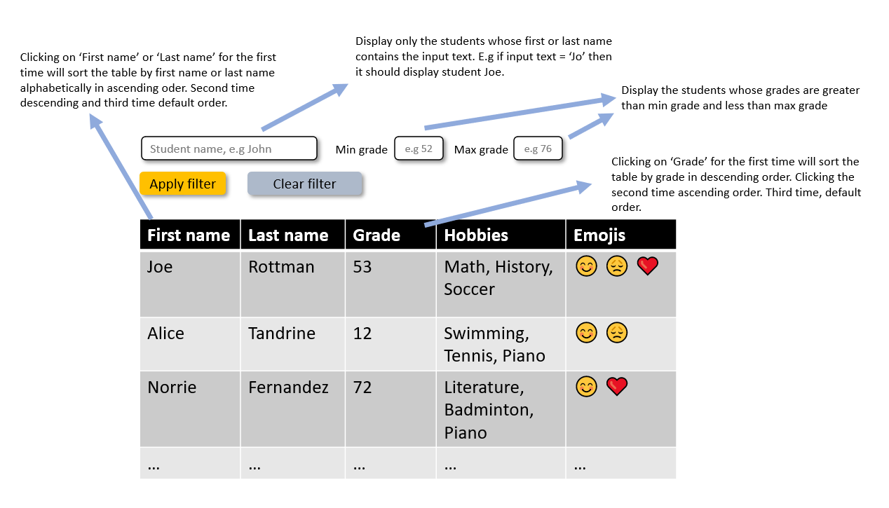

# Student Table



_Fig. Student table with custom filters._

## Provided resources

You are given a list of students which will be used to display in the table (feel free to modify/add more students).

```Javascript
const students = [
  {
    name: "Joe Rottman",
    grade: 42,
    hobbies: ["Math", "History", "Soccer"],
    emojis: [":)", ":(", "<3"],
  },
  {
    name: "Alice Tandrine",
    grade: 12,
    hobbies: ["Swimming", "Tennis", "Piano"],
    emojis: [":)", ":("],
  },
  {
    name: "Joel Jun",
    grade: 72,
    hobbies: ["Literature", "Badminton", "Piano"],
    emojis: [":)", "<3"],
  },
  {
    name: "Noah Rogan",
    grade: 2,
    hobbies: ["Singing", "Swimming", "Piano"],
    emojis: ["<3"],
  },
  {
    name: "Albert Einstein",
    grade: 100,
    hobbies: ["Judo", "Singing"],
    emojis: [":(", "<3"],
  },
  {
    name: "Roger Ferguson",
    grade: 98,
    hobbies: ["Music", "Swimming"],
    emojis: [":)"],
  },
];
```

### Emoji list:

`:)` -> 😊

`:(` -> 😞

`<3` -> ❤️

## Functional requirements

- For the purpose of this project, try NOT to use `for loops` and `while loops`. Use array methods (`map`, `filter`, `forEach`, etc.) instead.
- Display the students in a table of 5 columns (First name, last name, grade, hobbies and emojis) with custom filters.
- You will need to do some manipulations from the student array to extract the required info in order to insert them into the table (e.g you need to convert the emoji strings into actual icons)

There are various types of filters.

### Table filters

- Search name filter: Display only the students whose first or last name contains the input search text. E.g if input text = ‘jo’ then it should display student Joe or student Joel. Input text should be case `insensitive`.

- Grade filter: Display the students whose grades are greater than `min grade` and less than `max grade`

### Column filters:

- First name and last name columns: Clicking on ‘First name’ (or ‘Last name’) for the first time will sort the table by first name (or last name) alphabetically in ascending order. Clicking it the second time will sort it in descending order and third click in default order. Fourth click sorts it back ascending order and so on...

- Grade column: Clicking on ‘Grade’ for the first time will sort the table by grade in descending order. Second click ascending order. Third click default order. Fourth click in descending order and so on...

- Clicking on `Apply filter` button should apply all the filters.
- Clicking on `Clear filter` button should clear all the filters and display the table in the unsorted/unfiltered (default) order.

  

  _Fig 2. Table with filters._

## Visual requirements

- The goal is to replicate the UI of the given design. There's no need to make it look exactly the same as the design (as long as it looks somewhat similar to the original design it's good enough).
- For this project, focus more on the layout/structure and less on specific styling details (color, border, font size, etc.) for each element.

## Project Structure

(Recommended)

```bash
StudentTable
├── index.html
├── styles.css
├── script.js
└── README.md
```

## Deployment

Deploy and host it on Netlify (hint: google "Netlify Drag and Drop"). Once deployed, include the URL in the Readme.

Demo link: [xxx].netlify.app

## Version Control

Make sure to use Git and host the source code on your personal Github.

## Skills assessed

### HTML/CSS

- Display table in HTML
- Apply custom styles using CSS

### Javascript

- Manipulate DOM
- Handle events
- Array methods
- Use Git
- Deploy static site
